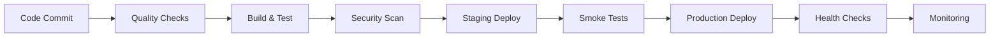

# CI/CD Pipeline and Health Checks Documentation

## Overview

This document outlines the comprehensive CI/CD pipeline and health check implementation for the Warehouse Management System, following DevOps best practices for continuous integration, deployment, and monitoring.

---

## 🚀 CI/CD Pipeline Architecture

### **Pipeline Stages**

#### **1. Code Quality & Security Stage**
- **Checkstyle**: Code style and formatting validation
- **SpotBugs**: Static code analysis for bug detection
- **OWASP Dependency Check**: Security vulnerability scanning
- **SonarCloud**: Code quality analysis and technical debt tracking

#### **2. Build & Test Stage**
- **Unit Tests**: JUnit test execution with JaCoCo coverage
- **Integration Tests**: Database integration testing
- **Code Coverage**: JaCoCo report generation and threshold enforcement
- **Test Results**: Automated test result publishing

#### **3. Security Scanning Stage**
- **Trivy**: Container and dependency vulnerability scanning
- **SARIF Reports**: Security findings integration with GitHub Security

#### **4. Build & Package Stage**
- **Docker Build**: Multi-stage container image creation
- **Image Security**: Minimal runtime image with security hardening
- **Artifact Publishing**: Container registry deployment

#### **5. Deployment Stage**
- **Staging Deployment**: Automated deployment to staging environment
- **Smoke Tests**: Post-deployment health and functionality verification
- **Production Deployment**: Controlled production deployment with approvals
- **Health Monitoring**: Post-deployment health checks and monitoring

---

## 🏥 Health Check Implementation

### **Health Check Components**

#### **1. System Health Check**
```java
@ApplicationScoped
public class WarehouseSystemHealthCheck {
    
    public Map<String, Object> getHealthStatus() {
        // Application status, uptime, version
        // System resources (memory, CPU)
        // Business metrics (warehouses, operations, error rate)
    }
    
    public boolean isHealthy() {
        // Memory usage < 90%
        // CPU load < 2x available processors
        // Business metrics within thresholds
    }
}
```

#### **2. Health Check Endpoints**
- **GET /health**: Comprehensive health status
- **GET /health/live**: Liveness probe
- **GET /health/ready**: Readiness probe
- **GET /health/metrics**: Detailed metrics
- **GET /health/check/{component}**: Component-specific checks

#### **3. Health Check Metrics**
```json
{
  "status": "UP",
  "uptime": "PT2H30M45S",
  "version": "1.0.0",
  "memory": {
    "heap_usage_percent": 45.2,
    "non_heap_usage_percent": 12.8
  },
  "cpu": {
    "available_processors": 4,
    "system_load_average": 2.1
  },
  "business_metrics": {
    "active_warehouses": 10,
    "pending_operations": 5,
    "error_rate": 0.01,
    "response_time": 150.5
  }
}
```

---

## 🔧 Configuration Files

### **1. GitHub Actions Workflow**
- **File**: `.github/workflows/ci-cd-pipeline.yml`
- **Triggers**: Push to main/develop, pull requests
- **Environments**: staging, production
- **Security**: GitHub secrets for sensitive data

### **2. Docker Configuration**
- **File**: `Dockerfile`
- **Multi-stage build**: Builder + runtime stages
- **Security**: Non-root user, minimal runtime image
- **Health Check**: Built-in container health monitoring

### **3. Quality Gates**
```yaml
# Code Quality Gates
- Checkstyle: No violations
- SpotBugs: No high-severity bugs
- OWASP: No critical vulnerabilities
- SonarCloud: Quality Gate passed
- JaCoCo: 80% minimum coverage
```

---

## 📊 Monitoring & Observability

### **1. Application Metrics**
- **System Metrics**: Memory, CPU, disk usage
- **Business Metrics**: Active warehouses, operations, error rates
- **Performance Metrics**: Response times, throughput
- **Custom Metrics**: Domain-specific KPIs

### **2. Health Check Integration**
- **Kubernetes**: Liveness and readiness probes
- **Load Balancers**: Health check endpoints
- **Monitoring Systems**: Prometheus metrics collection
- **Alerting**: Automated notifications for health issues

### **3. Logging Strategy**
- **Structured Logging**: JSON format for machine parsing
- **Log Levels**: DEBUG, INFO, WARN, ERROR with appropriate usage
- **Correlation IDs**: Request tracking across distributed systems
- **Security**: No sensitive data in logs

---

## 🚀 Deployment Strategies

### **1. Environment Management**
- **Development**: Feature branch deployments
- **Staging**: Integration testing environment
- **Production**: Customer-facing environment
- **Disaster Recovery**: Backup and rollback procedures

### **2. Deployment Pipeline**


### **3. Rollback Strategy**
- **Automated Rollback**: Health check failures trigger automatic rollback
- **Manual Rollback**: Emergency rollback procedures
- **Blue-Green Deployment**: Zero-downtime deployments
- **Canary Releases**: Gradual traffic shifting

---

## 🔒 Security Considerations

### **1. CI/CD Security**
- **Secret Management**: GitHub secrets for sensitive data
- **Access Control**: Role-based access to deployments
- **Audit Trails**: Complete deployment history
- **Vulnerability Scanning**: Automated security checks

### **2. Container Security**
- **Minimal Base Images**: Reduced attack surface
- **Non-root User**: Privilege separation
- **Security Scanning**: Trivy vulnerability detection
- **Image Signing**: Cryptographic image verification

### **3. Runtime Security**
- **Health Check Authentication**: Secure endpoint access
- **Rate Limiting**: Prevent abuse of health endpoints
- **Network Security**: Firewall and ingress controls
- **Monitoring**: Security event detection

---

## 📈 Performance Optimization

### **1. Build Performance**
- **Dependency Caching**: Maven dependency caching
- **Parallel Execution**: Parallel test execution
- **Incremental Builds**: Only build changed components
- **Build Optimization**: JVM tuning for build performance

### **2. Deployment Performance**
- **Image Optimization**: Multi-stage builds, layer caching
- **Network Optimization**: CDN usage, compression
- **Resource Management**: Efficient resource allocation
- **Scaling Strategies**: Horizontal and vertical scaling

### **3. Runtime Performance**
- **Health Check Efficiency**: Lightweight health checks
- **Monitoring Overhead**: Minimal performance impact
- **Resource Utilization**: Optimal memory and CPU usage
- **Response Times**: Fast health check responses

---

## 🔄 Continuous Improvement

### **1. Pipeline Optimization**
- **Build Time Reduction**: Parallel execution, caching
- **Test Efficiency**: Test parallelization, smart test selection
- **Deployment Speed**: Optimized deployment strategies
- **Feedback Loops**: Fast failure detection and notification

### **2. Quality Enhancement**
- **Code Quality Metrics**: Continuous quality monitoring
- **Test Coverage**: Targeted test coverage improvements
- **Security Posture**: Ongoing security enhancements
- **Documentation**: Living documentation updates

### **3. Monitoring Improvement**
- **Metrics Enhancement**: Additional business metrics
- **Alerting Optimization**: Reduced false positives
- **Dashboard Improvements**: Better visualization
- **Automation**: Increased automation of manual tasks

---

## 🎯 Best Practices

### **1. CI/CD Best Practices**
- **Fast Feedback**: Quick build and test execution
- **Fail Fast**: Early failure detection and notification
- **Immutable Infrastructure**: Consistent environments
- **Infrastructure as Code**: Version-controlled infrastructure

### **2. Health Check Best Practices**
- **Comprehensive Coverage**: All critical components monitored
- **Appropriate Granularity**: Right level of detail
- **Performance Awareness**: Minimal overhead
- **Actionable Alerts**: Meaningful notifications

### **3. Security Best Practices**
- **Defense in Depth**: Multiple security layers
- **Least Privilege**: Minimal necessary permissions
- **Regular Updates**: Keep dependencies current
- **Security Testing**: Ongoing security validation

---

## 📋 Implementation Checklist

### **CI/CD Pipeline**
- [ ] GitHub Actions workflow configured
- [ ] Code quality checks implemented
- [ ] Security scanning enabled
- [ ] Automated testing pipeline
- [ ] Container build process
- [ ] Deployment automation
- [ ] Environment-specific configurations
- [ ] Rollback procedures

### **Health Checks**
- [ ] System health check implementation
- [ ] Health check REST endpoints
- [ ] Liveness and readiness probes
- [ ] Business metrics monitoring
- [ ] Performance thresholds
- [ ] Alerting configuration
- [ ] Dashboard integration
- [ ] Documentation updates

### **Security**
- [ ] Secret management
- [ ] Container security scanning
- [ ] Runtime security measures
- [ ] Access control implementation
- [ ] Audit trail configuration
- [ ] Security testing
- [ ] Compliance validation
- [ ] Incident response procedures

---

## 🎉 Expected Outcomes

### **1. Development Efficiency**
- **Faster Development**: Automated pipeline reduces manual work
- **Higher Quality**: Automated quality gates ensure standards
- **Better Collaboration**: Shared understanding of processes
- **Reduced Risk**: Automated testing and security checks

### **2. Operational Excellence**
- **High Availability**: Health checks ensure service reliability
- **Fast Recovery**: Automated rollback and recovery procedures
- **Scalability**: Automated scaling and deployment
- **Monitoring**: Comprehensive observability

### **3. Business Value**
- **Faster Time to Market**: Automated deployment pipeline
- **Reduced Costs**: Automation reduces manual overhead
- **Better Quality**: Comprehensive testing and monitoring
- **Risk Mitigation**: Security and compliance automation

The CI/CD pipeline and health check implementation provides a solid foundation for continuous delivery and operational excellence in the Warehouse Management System.
